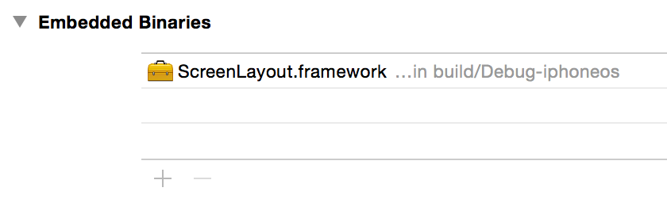
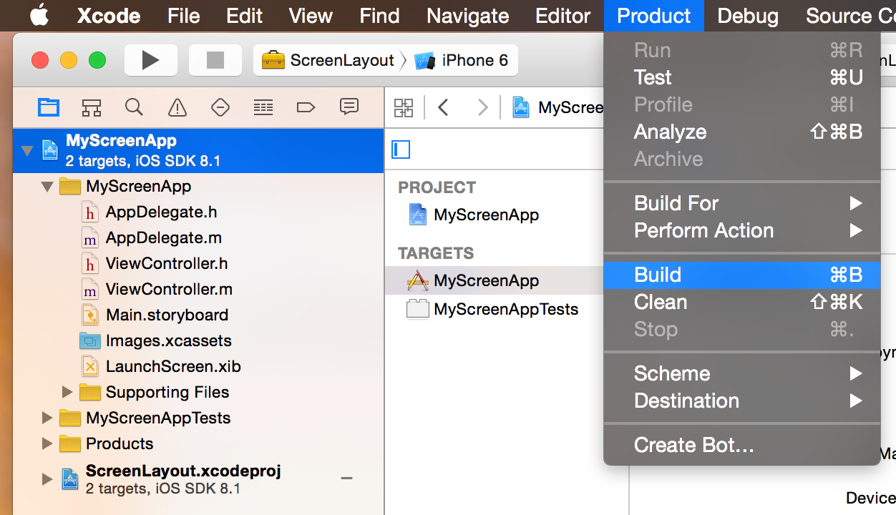

*NOTE: THIS PROJECT IS NO LONGER MAINTAINED*

# ScreenLayout.framework

- Connects multiple iOS device screens by 'Pinch' gesture
- Built on top of MultipeerConnectivity, no other dependencies
- Communicates via Bluetooth, no Wi-Fi required

## Video

## Press

- [The Verge](https://www.theverge.com/2012/11/1/3584632/pinch-smartphone-tablet-synchronized-display-link-interface-app)
- [Engadget](https://www.engadget.com/2012/11/02/tokyo-university-of-technologys-pinch-interface-creates-video-walls/)

## Paper

- [Using Pinching Gesture to Relate Applications Running on Discrete Touch-Screen Devices](http://www.igi-global.com/article/using-pinching-gesture-to-relate-applications-running-on-discrete-touch-screen-devices/84123)

## Installation

### iOS 8 Embedded Framework
Add the ScreenLayout.xcodeproj to your project and adding ScreenLayout.framework to the Embedded Binaries section on the General tab of your app's target.

Then build ScreenLayout framework to enable `@import ScreenLayout` syntax with header modules. This step is not necessary if you don't mind the Xcode warning message displayed until you build your app.

**Note**: this method does not currently play nicely with workspaces. For some unknown reason, Xcode simply rejects adding ScreenLayout.framework as an embedded binary when ScreenLayout.xcodeproj is placed in the workspace. This only works when ScreenLayout.xcodeproj is added as a subproject to the current target's project.

### Advanced
Alternatively, you can add the project to your workspace and adopt the provided configuration files or manually copy the files under the ScreenLayout subdirectory into your project.

## License

ScreenLayout is released under the MIT license. See LICENSE for details.
